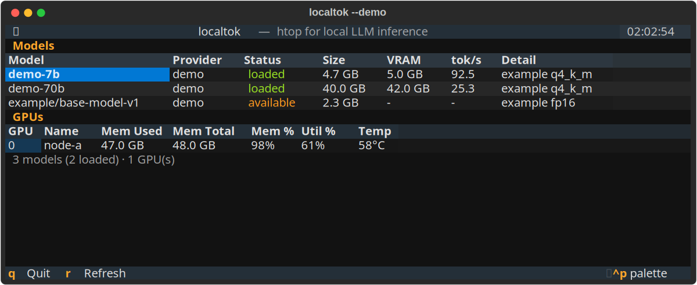
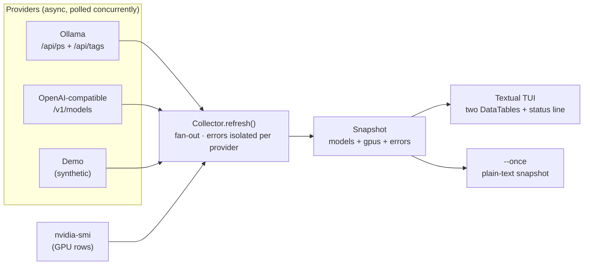

# localtok

> **`htop` for local LLM inference** — a live terminal dashboard for tokens/sec, VRAM and loaded models across your local LLM servers.

[](LICENSE)
[](https://www.python.org/downloads/)
[](#how-it-works)
[](https://docs.astral.sh/uv/)
[](#contributing)

When you run models locally, the questions are always the same: *what's loaded
right now, how much VRAM is it eating, and how fast is it going?* Today those
answers are scattered across `ollama ps`, `nvidia-smi`, and whatever your
OpenAI-compatible server happens to expose. **localtok** pulls them into one
always-on table — point it at your servers, leave it running in a pane, and
glance over whenever you want the state of your inference rig.

## Demo

No LLM server and no GPU required — `--demo` feeds the dashboard synthetic data
so you can try it anywhere:

```bash
uv run localtok --demo
```



> The image above is a real screenshot exported from the running Textual app
> (`--demo`, synthetic data). The live TUI is colorized and refreshes on a
> timer; `q` quits, `r` forces a refresh.

For scripts, CI, or a quick paste, `--once` prints a single plain-text snapshot
instead of launching the TUI:

```console
$ localtok --demo --once
== Models ==
Model                  Provider  Status     Size     VRAM     tok/s  Detail
---------------------  --------  ---------  -------  -------  -----  --------------
demo-7b                demo      loaded     4.7 GB   5.0 GB   92.4   example q4_k_m
demo-70b               demo      loaded     40.0 GB  42.0 GB  25.2   example q4_k_m
example/base-model-v1  demo      available  2.3 GB   -        -      example fp16

== GPUs ==
GPU  Name    Mem Used  Mem Total  Mem %  Util %  Temp
---  ------  --------  ---------  -----  ------  ----
0    node-a  47.0 GB   48.0 GB    98%    61%     58°C

3 models (2 loaded) · 1 GPU(s)
```

## Install

Requires Python 3.10+. The recommended path is [uv](https://docs.astral.sh/uv/):

```bash
# As a standalone CLI tool, from a local clone:
git clone <your-fork-url> localtok
cd localtok
uv tool install .
localtok --demo

# Or run straight from the source tree without installing globally:
uv sync
uv run localtok --demo
```

With pipx or pip:

```bash
pipx install .        # isolated CLI install
# or
pip install -e .      # editable install into the current environment
localtok --demo
```

## Usage

```bash
# Synthetic data — runs anywhere, no LLM server or GPU required.
localtok --demo

# Auto-detect local servers (Ollama on :11434 + an OpenAI-compatible server
# on :8000) plus any NVIDIA GPUs via nvidia-smi.
localtok

# Point at specific servers.
localtok --ollama http://127.0.0.1:11434 --openai http://127.0.0.1:8000

# One-shot plain-text snapshot (great for scripts, CI, or a screenshot).
localtok --demo --once

# Skip GPU discovery and slow the refresh down.
localtok --no-gpu --interval 2.0
```

In the live dashboard: **`r`** refreshes now, **`q`** quits.

### Configuration

Every option is settable by flag or environment variable. Copy
[`.env.example`](.env.example) to `.env` and edit it (the `.env` file is
git-ignored). No secrets are hardcoded anywhere — an API key, if your server
needs one, is read from `LOCALTOK_OPENAI_API_KEY` and only sent when present.

| Env var | Flag | Default | Purpose |
| --- | --- | --- | --- |
| `LOCALTOK_OLLAMA_URL` | `--ollama URL` | `http://127.0.0.1:11434` | Ollama server |
| `LOCALTOK_OPENAI_URL` | `--openai URL` | `http://127.0.0.1:8000` | OpenAI-compatible server |
| `LOCALTOK_OPENAI_API_KEY` | — | _(none)_ | Optional bearer token |
| `LOCALTOK_INTERVAL` | `--interval N` | `1.0` | Refresh interval (seconds) |

## How it works



- **Providers** are small async adapters behind one interface (`Provider.poll`):
  - **Ollama** — `GET /api/ps` (loaded models, with real VRAM via `size_vram`)
    merged with `GET /api/tags` (the full local library). Loaded models sort
    first and win any name collision so VRAM info is never lost.
  - **OpenAI-compatible** — `GET /v1/models`, the lowest common denominator that
    works with llama.cpp's server, vLLM, LM Studio, LocalAI and friends. This
    endpoint only lists model ids, so those models show as `available` with a
    name and no VRAM/tok/s.
  - **Demo** — fabricated data for `--demo` (and a deterministic source for the
    tests).
- **GPU rows** come from `nvidia-smi --query-gpu=...` in stable CSV form; if the
  binary is absent the GPU section is simply empty. The subprocess runs off the
  event loop so it never blocks the UI.
- The **Collector** polls every provider concurrently. A failing or offline
  server becomes a counted error in the status line — it never crashes the
  dashboard or blocks the other providers.
- The **Textual** app owns a refresh timer and repaints two `DataTable`s. The
  rendering logic is a pure function (`build_renderables`), so the dashboard's
  output is unit-tested without spinning up a terminal.

All parsing lives in pure functions tested against captured JSON/CSV fixtures,
so the whole suite runs with **no live server and no GPU**:

```bash
uv run pytest -q     # 44 passed, 1 skipped
```

The one skipped test is an *opt-in* privacy guard: point
`$LOCALTOK_PRIVACY_DENYLIST` (or drop a git-ignored
`tests/privacy_denylist.local.txt`) at a list of tokens that must never appear
in committed files, and it activates. The structural privacy checks
(no real home paths, no VPN-range IPs) always run.

## How this differs from existing tools

This space has good tools already; localtok deliberately fills the gap *between*
them. Honest comparison:

| Tool | What it shows | The gap localtok fills |
| --- | --- | --- |
| `nvidia-smi` / [`nvitop`](https://github.com/XuehaiPan/nvitop) | GPU utilization, memory, processes | Knows nothing about *which model* owns the VRAM or how fast it's generating. |
| `ollama ps` | Ollama's currently-loaded models | One server, one snapshot, no GPU view, no live refresh, no other backends. |
| vLLM / llama.cpp metrics, Prometheus + Grafana | Rich server-side metrics | Heavy to stand up for a single workstation; built for clusters, not a glance in a tmux pane. |

localtok's niche: a **single, dependency-light terminal view that unifies models
+ VRAM + GPUs across multiple local backends at once**, with the ergonomics of
`htop` rather than a dashboard server you have to deploy.

### Project status

This is an early (`v0.1`), MIT-licensed, fully-tested foundation. What's real
and working today:

- ✅ Ollama, OpenAI-compatible, and demo providers, with concurrent polling and
  per-provider error isolation.
- ✅ Live Textual TUI **and** scriptable `--once` plain-text output.
- ✅ NVIDIA GPU rows via `nvidia-smi`; real VRAM per loaded Ollama model.
- ✅ 44 passing tests; parsing exercised against captured fixtures.

Being honest about the edges: **per-model live tokens/sec is synthetic in
`--demo` and not yet measured against real servers** — `/api/ps` and
`/v1/models` don't expose a throughput number, so wiring up real tok/s (by
tailing a streaming completion) is the headline roadmap item below.

## Roadmap

- [ ] Live tok/s for real servers by tailing a streaming completion.
- [ ] Sparkline history per model (tok/s over the last N ticks).
- [ ] More adapters: llama.cpp native endpoints, vLLM metrics, TGI.
- [ ] AMD / Intel GPU support (`rocm-smi`, `xpu-smi`).
- [ ] Sort/filter keybindings and a per-model detail pane.
- [ ] Optional Prometheus exporter mode.

## Contributing

Contributions are welcome. The architecture is intentionally small, so a new
backend is the easiest first PR:

1. Add an adapter under `src/localtok/providers/` that subclasses `Provider` and
   implements `poll()`, keeping all JSON parsing in standalone `parse_*`
   functions.
2. Add fixtures under `tests/fixtures/` and a test that parses them — no live
   server in the test suite.
3. Run `uv run pytest -q` and make sure the privacy guard stays green.

Open an issue first for larger changes so we can agree on the shape.

## License

[MIT](LICENSE) © Aman Zainal.
